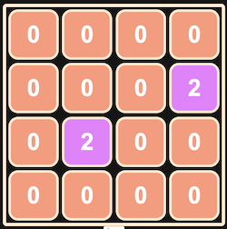
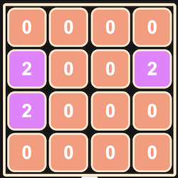
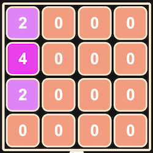

# 2048

### **Game Goal:** Move tiles until one tile reads 2048. 
### **Inital Board:** Game begins with two randomly placed "2" tiles.

### **To Play:** 
https://tatty-k.github.io/2048/
### - Click arrow keys to move tiles. All tiles on board will move in the direction of the arrow clicked and a new "2" tile will appear at a random spot on the board. Result of left arrow click shown below. 

### - If tiles containing the same number "colid" in the direction of the arrow click they squish into one tile and their numbers add. Result of a second left arrow click show below.

### **Technology Used:** JavaScript, HTML, CSS

### **Next Steps:** Reset button. Add sliding animation using jQuery. Make high score tracker that keeps track of individual users highest score. 

### **Game History:** 2048 is a one player game that was designed by Gabriele Cirulli in one weekend. The game was released March 9th 2014 as free and open-source software that is subject to the MIT license(wikipedia citation). 

